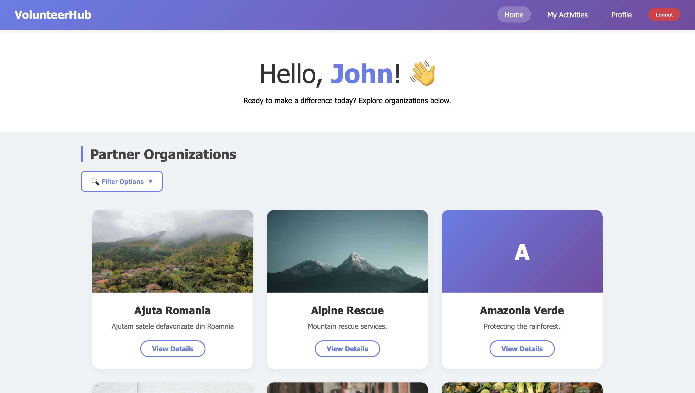
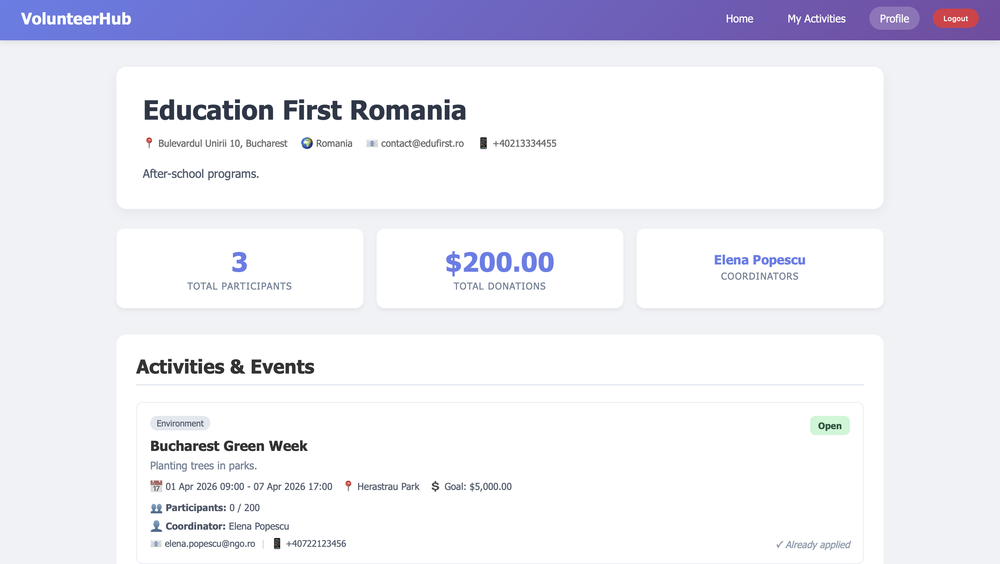
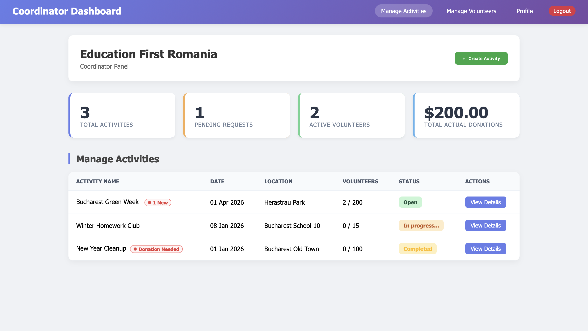
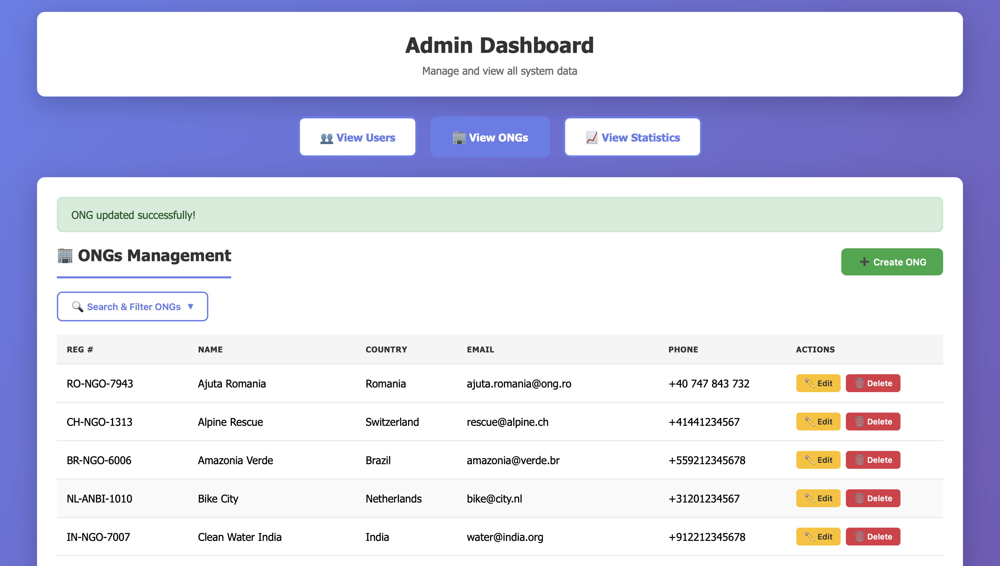

# NGO Management System (Non-ORM)


A full-stack web application designed to help manage NGOs, volunteering activities and users.

This project was built as an assignment for the **Databases** course at the National University of Science and Technology POLITEHNICA Bucharest (UNSTPB), Faculty of Automatic Control and Computer Science.

## Why "Non-ORM"?

As a specific requirement from the university, this project was built entirely **without an ORM** (like Hibernate or JPA). The goal was to practice and demonstrate a strong understanding of pure SQL.

By using raw SQL queries and JDBC with manual `RowMapper` implementations, this project highlights:
* Writing complex queries (JOINs, aggregations, subqueries) from scratch.
* Database security using Prepared Statements against SQL Injection.
* A clear MVC and DAO architecture separating business logic from data access.

## Features (Role-Based Access)

The app uses Spring Security to manage 3 types of users:

* **Administrator:** Manages the entire platform, registers new NGOs and has full CRUD access over the system's data.
* **Coordinator:** Creates and manages volunteering activities, edits their NGO's profile and tracks volunteer applications.
* **Volunteer:** Browses available activities, applies to them, tracks personal hours and competes on a global leaderboard.

## Tech Stack

* **Backend:** Java 17, Spring Boot, Spring Security
* **Frontend:** HTML5, CSS3, Thymeleaf
* **Database:** MySQL / PostgreSQL
* **Architecture:** MVC, DAO Pattern

## Setup & Run

All the database configuration scripts (creating tables, inserting mock data, cleaning up) can be found in the `/db` directory.

1. **Clone the repo:**
   ```bash
   git clone https://github.com/gaabi16/ngo-management-system-non-orm.git
   cd ngo-management-system-non-orm
   ```
2. **Set up the Database:**
   * Run the `/db/create_tables.sql` and `/db/create_entries_for_all_tables.sql` scripts in your local SQL server.
   * Add your DB credentials in `src/main/resources/application.properties`:
     ```properties
     spring.datasource.url=jdbc:mysql://localhost:3306/your_db_name
     spring.datasource.username=your_username
     spring.datasource.password=your_password
     ```
3. **Run the app:**
   ```bash
   ./mvnw spring-boot:run
    ```
Then open http://localhost:8080 in your browser.

## Screenshots

<p align="center">
  
</p>

<p align="center">
  
</p>

<p align="center">
  
</p>

<p align="center">
  
</p>

## Author

**Crișan Gabriel - Daniel**

- LinkedIn: https://linkedin.com/in/gabriel-crisan16/
- Email: gabicrisan01@gmail.com
